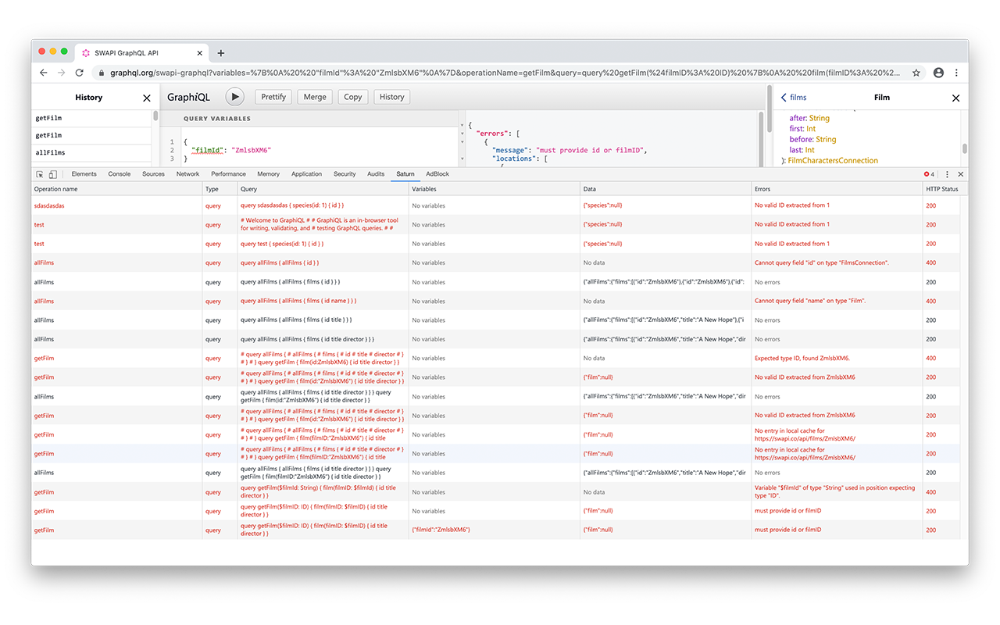
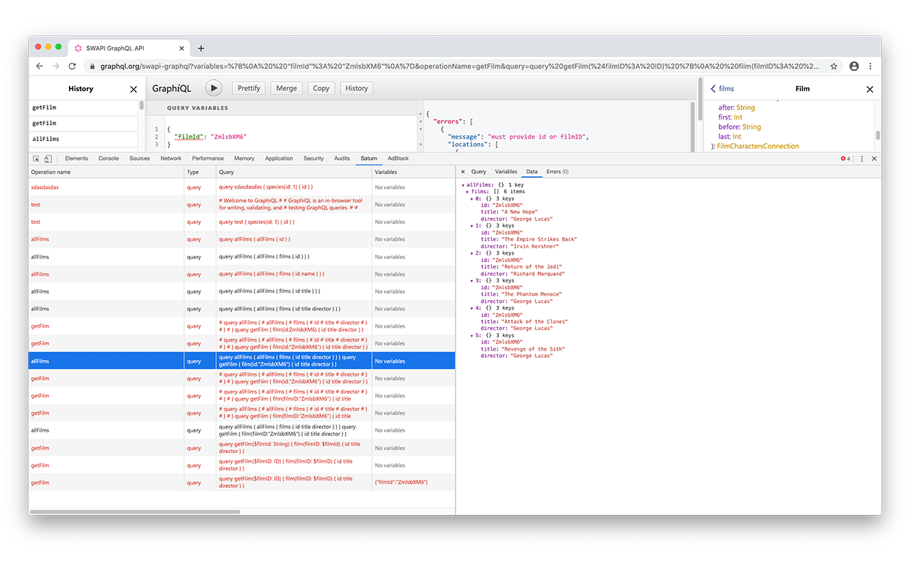

# Saturn

Saturn is a [Chrome DevTools](https://chrome.google.com/webstore/detail/saturn/niddeggaegffgancpopjccbmmhpdfflf) extension to debug GraphQL queries. Acts like a Network tab, but for GraphQL requests only.





## How to dev

```
$ yarn install
$ yarn build
```

In Chrome Extensions list, enable developer mode, and use "Load unpacked" to load content of `dist` folder.

You can also dev by running

```
yarn start:dev
```

but it's only useful for UI part.