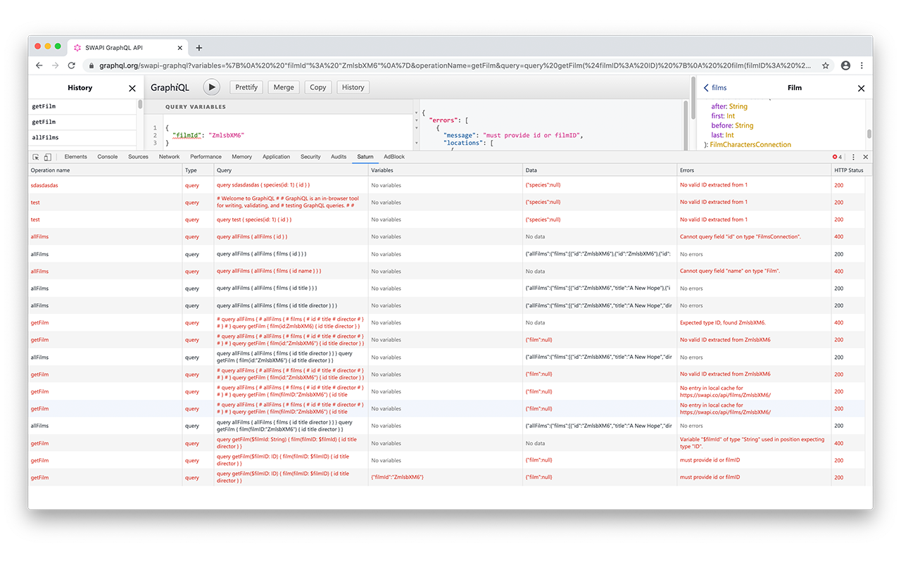
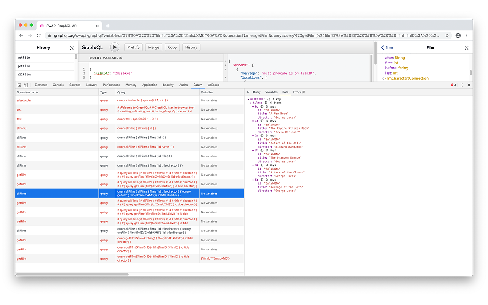

# Saturn

Saturn is a [Chrome DevTools](https://chrome.google.com/webstore/detail/saturn/niddeggaegffgancpopjccbmmhpdfflf) extension to debug GraphQL queries. Acts like a Network tab, but for GraphQL requests only.





## How to dev

```
$ yarn install
$ yarn build
```

In Chrome Extensions list, enable developer mode, and use "Load unpacked" to load content of `dist` folder.

You can also dev by running

```
yarn start:dev
```

but it's only useful for UI part.

## How to publish

```
$ yarn package
```

This does a production build and writes `saturn-<version>.zip` in the project
root, ready to upload to the [Chrome Web Store developer
dashboard](https://chrome.google.com/webstore/devconsole). The archive contains
only what the extension needs, with `manifest.json` at the root as the store
requires.

The version comes from `src/manifest.json` — bump that (and `package.json`, to
keep them in sync) before packaging a release.

Note that `yarn pack` is a built-in Yarn command that makes an npm tarball, not
an extension archive. The command you want is `yarn package`.
